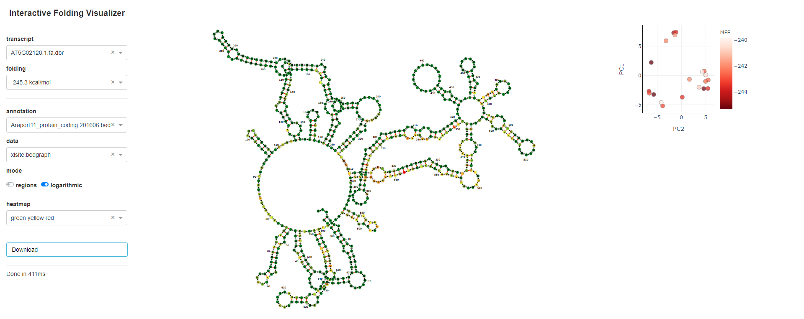

# Interactive Folding Visualizer
IFV is a tool for visualizing RNA secondary structures and protein binding sites.

## Table of Contents

* [Requirements](#requirements)
* [Usage](#usage)
* [User interface](#User interface)
* [Overview of file formats used](#Overview of file formats)
* [Color customization](#Color customization)
* [Contact](#contact)
* [License](#license)

## Requirements

In the requirements.txt all required packages are listed.

To install your packages using requirements.txt, execute the following:
1. Open a terminal or command prompt
2. Navigate to the folder with your requirements.txt
3. ``` pip3 install -r requirements.txt```
4. You are done installing dependencies

## Usage:

```
python3 ifv.py
```

optional input arguments
```
    -i, --input     Input directory containing the 4 folders: annotation, data, transcript and config.
                    Add new files according to the following principle:
                        annotation - 12-column .bed format
                        data - 4-column .bedgraph format and 6-column .bed format
                        transcript - .fa.dbr containing the sequence and foldings with corresp. energy
                        config - regions.txt and heatmaps.txt containing colors for the visualization
    -p, --port      Custom port, default: 8050.
```

## User interface


## Overview of file formats
Only the following file formats are accepted and processed by IFV:
```
### .fa.dbr (transcript) 
>ENERGY = -62.8  AT1G07600.1::Chr1:2338904-2339321(-)
AUGGCAGAUUCUAACUGUGGAUGUGGCUCCUCCUGCAAAUGUGGUGACUCUUGCAGUUGCGAGAAGAACUACAACAAGGAGUGCGACAACUGUAGCUGUGGAUCAAACUGCAGCUGUGGGUCAAACUGUAACUGUUGA
...((((.......))))....((.((..(((((.....((((((...((((((....))))))...))))))...))))).)).))..((((((((((((......)))))))))))).((((.(.......)))))
>ENERGY = -50.0  AT1G07600.1::Chr1:2338904-2339321(-)
......(((((...((((((.(((.((..((.(......((((((...((((((....))))))...)))))).....))).)).))).))))))....))))).....((((.(((((......))))).))))...


### .bed 12-column (annotation) 
chrom   chromStart  chromEnd    name            score   strand  thickStart  thickEnd    itemRgb blockCount  blockSizes  blockStarts  
Chr2	539897	    540707	AT2G02130.1     0	+	540070	    540407	0	2	    237,470,	0,340,


### .bed 6-column (data)
chrom   start       stop                 strand
Chr1    10474880    10474881    X    1   -


### .bedgraph 4-column (data)
chrom   start       stop        reads
Chr1	10474941    10474942	14
```

## Color customization
To use your own color schemes for the visualisation of the regions or the heatmap, you can adjust the regions.txt or the heatmaps.txt.

The color schemes for the heatmap are selectable in the drop-down menu of the user interface. 

```
### heatmaps.txt
blue white red = #0066FF #FFFFFF #FF0000
identifier = white yellow green blue red black

### regions.txt
intron = #FFFFFF
3' = green
5' = red
cds = #0066FF
```


## Contact

For questions or problems, please feel free to write an email and I will get back to you as soon as possible.

[msohn@techfak.uni-bielefeld.de](mailto:msohn@techfak.uni-bielefeld.de)
.

## License

* The dash package is licensed under the [MIT license](https://github.com/plotly/dash/blob/dev/LICENSE).
* The visdccc package is licensed under the [MIT license](https://github.com/jimmybow/visdcc/blob/master/LICENSE.txt).
* The plotly package is licensed under the [MIT license](https://github.com/plotly/plotly.py/blob/master/LICENSE.txt).
* The sklearn package is licensed under the [3-Clause BSD license](https://github.com/scikit-learn/scikit-learn/blob/main/COPYING).
* IFV is licensed under the [MIT license](https://github.com/masohn/IFV/blob/main/LICENSE).
